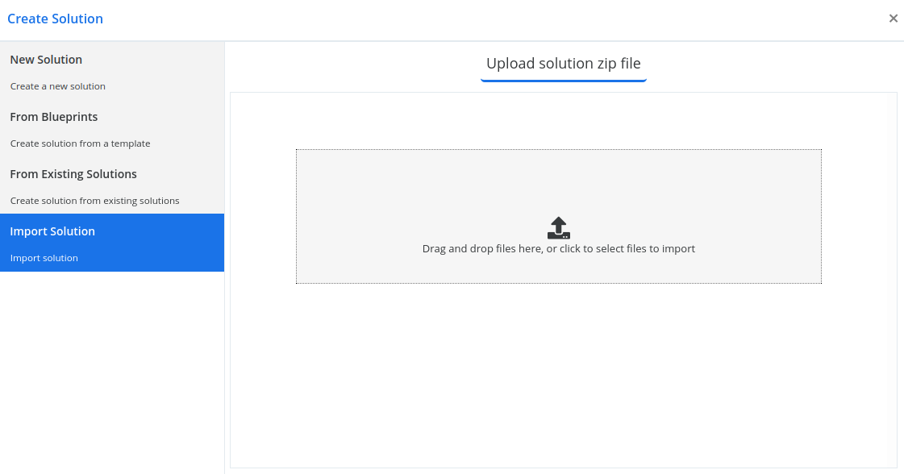

## Import Solution

You can manually import solutions using the steps in this article. You must import only those solutions that you've obtained from a trusted source.

When you import an unmanaged solution:

> You add all the components of that solution into your environment and can't delete the components by deleting the solution. Deleting the unmanaged solution deletes only the solution container.

>That contains components you have already customized, your customizations will be overwritten by the customizations in the imported unmanaged solution. You can’t undo this.

