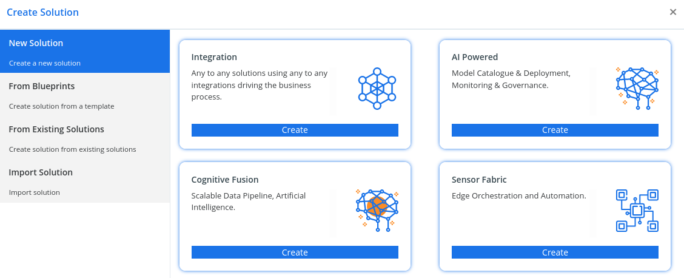

# Create Solution

After you save the solution, you may wish to add information to columns that aren’t required. These steps are optional. Use the Description column to describe the solution and choose an HTML web resource as a Configuration Page for the solution. The configuration page is typically used by ISVs who distribute solutions. When this is set, a new Configuration node appears below the Information node to display this web resource. Developers will use this page to include instructions or controls to allow you to set configuration data or launch their solution.

After you’ve created your solution, it won’t contain any solution components. You can create new components to be added to the solution or add existing components to your new solution.

You can use the New command to create different types of components. This takes you to a different create experience depending on the component type that you choose. After you finish creating the component, it will be added to the solution.

