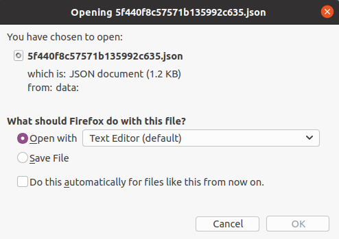

## Export solution

You can manually export solutions using the steps in this article. We recommend that you create an unmanaged solution to use for exporting your customizations, and then export your customizations periodically so that you have a backup in case anything happens. You can't export managed solutions or the Default Solution.

